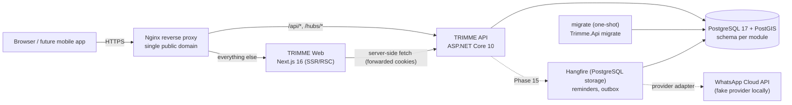
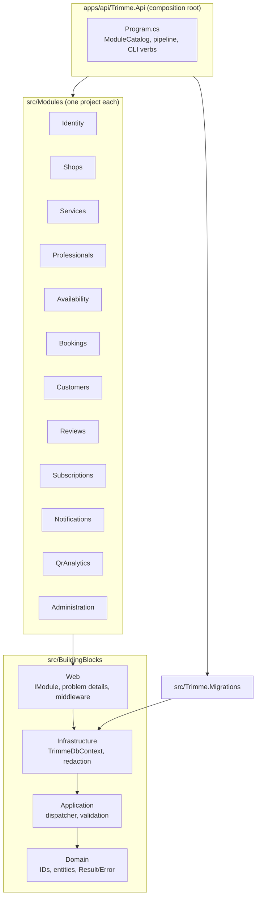

# TRIMME Architecture

Status: **initial (Phase 01)**. Sections are extended as phases land. Decisions referenced as D-xxx live in [`implementation/DECISIONS.md`](implementation/DECISIONS.md).

## 1. Deployed topology

- **One public domain** (D-027). Cookies are first-party, and CORS is empty in production. In local development the web app runs on `http://localhost:3000`, which is the only allowed CORS origin.
- **Migrations are an explicit release step** (`Trimme.Api migrate`, compose service `migrate`). The API never migrates on startup.
- **Health:** `/health/live` checks the process and `/health/ready` checks the database. The container `HEALTHCHECK` uses `dotnet Trimme.Api.dll healthcheck`, because the runtime image has no curl.

## 2. Backend structure (D-038)

Dependency rules are enforced by `tests/Trimme.ArchitectureTests`:

- Building blocks point inward only: Domain ← Application ← Infrastructure ← Web. None of them reference modules.
- Inside a module, the `.Domain` namespace has no EF Core, ASP.NET Core, Npgsql, Serilog or FluentValidation dependency, and no dependency on its module's `.Application`, `.Infrastructure` or `.Api`. The `.Application` namespace does not depend on `.Infrastructure`, `.Api` or ASP.NET Core.
- A module may reference another module only through that module's `.Contracts` project. Both compiled references and `.csproj` project references are checked.
- Handlers and infrastructure types are `internal`.
- Every endpoint handler accepts a `CancellationToken`, and feature endpoints live under `/api/v1/`.

These rules were proven non-vacuous with deliberate violations (recorded in `implementation/phases/phase-01-backend-foundation.md`).

### Request flow

`HTTP → forwarded headers → correlation ID → security headers → exception handler / status-code problem details → request logging → body-size limit → CORS → rate limiter → endpoint → IDispatcher → pipeline behaviours (validation, …) → handler`.

### Errors

- Every error response is RFC 7807 `application/problem+json`. It always carries a stable `errorCode` (for example `validation.failed`, `resource.not_found`, `rate_limit.exceeded`, and later domain codes such as `booking.slot_unavailable`) and a `correlationId` that matches the `X-Correlation-Id` response header.
- Validation failures add `errors: { field: [codes] }`.
- Exception messages and stack traces are never returned to clients; they are logged.

### Persistence

- There is one `TrimmeDbContext`. Each module contributes its schema and entity configurations (`IModelContributor`).
- Naming is snake_case. Instants are `timestamptz` in UTC.
- Strongly typed UUIDv7 IDs are converted by convention.
- Optimistic concurrency maps `IConcurrencyVersioned.Version` to PostgreSQL `xmin`.
- The `postgis` and `btree_gist` extensions are enabled by the `Initial` migration.

### Logging and privacy

- Logging uses Serilog. Output is structured JSON outside Development.
- Every event passes through `RedactionEnricher`: properties with sensitive names (phone, mobile, whatsapp, token, password, otp, …) are replaced, and free text is scrubbed of phone numbers (including Saudi local and Arabic-Indic digits), bearer/JWT tokens and e-mail addresses.
- Request logs contain the path only, never query strings.

### Security baseline

- **CORS:** a strict allowlist with credentials; wildcards are rejected at startup.
- **Security headers:** `nosniff`, `DENY` framing, a strict CSP for API responses, a restrictive referrer policy and permissions policy, and no `Server` header.
- **Request bodies:** limited to 1 MB by default (a 413 problem response). Upload endpoints will opt into larger limits.
- **Rate limits:** named policies (`auth`, `otp`, `search`, `availability`, `booking`, `review`, `qr`), partitioned by client IP (by user from Phase 04). The limits are configurable, and rejections return a 429 problem response.
- **Forwarded headers:** trusted only from configured proxies.

## 3. Web application

Added in Phase 02. Locale routing uses `/ar` (RTL, default) and `/en`. The design tokens come from `design/analysis/01-design-system-and-docs.md`. The API client is generated from `apps/api/openapi/v1.json`.
