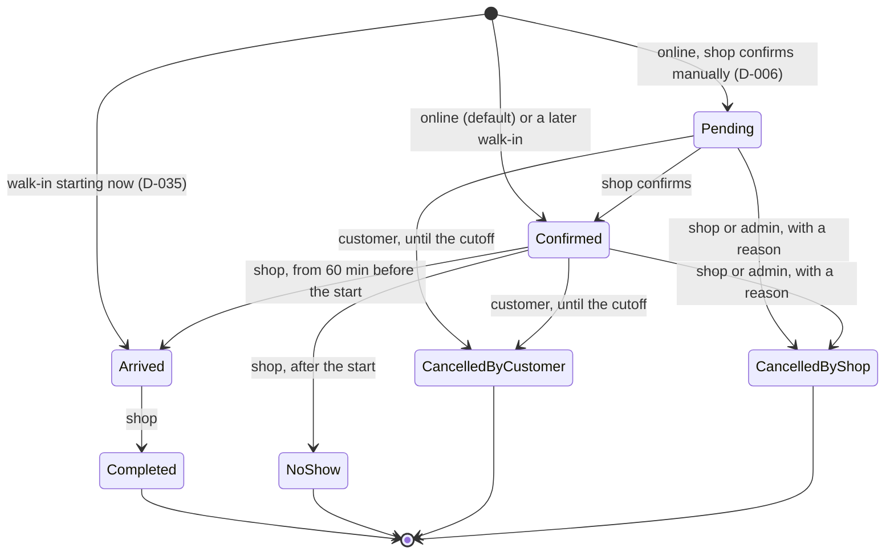

# Availability and booking

This document explains how TRIMME decides which appointment times can be booked (Phase 09), and how bookings are made, changed and kept consistent (Phase 10).

Decisions: D-009 (only bookable slots), D-012 (any professional), D-013 / D-083 (pause), D-014 / D-078 (subscription gate), D-030 (time), D-076 (platform settings), D-082 (engine), D-084 (API).

## Availability

### Inputs

| Input | Owner | Where |
|---|---|---|
| Weekly opening hours | Shop | `availability.shop_opening_hours`: one row per shop, the week as a JSON list of intervals |
| Closed days | Shop | `availability.shop_closures`: inclusive local dates |
| Online-booking pause | Shop | `shops.online_booking_pauses`: the row exists while paused (D-083) |
| Professional's weekly hours | Shop | `availability.professional_working_hours`: "follows the shop's hours" by default |
| Breaks (weekly or one date; one professional or everyone) | Shop | `availability.breaks` |
| Time off (vacation, sick, other) | Shop | `availability.professional_time_off`: UTC instants |
| Service or package duration, and who performs it | Shop (duration), admin (assignment) | Services module, through `IBookableOfferCatalog` |
| Existing non-cancelled appointments | Bookings (Phase 10) | `IBookedTimeReader`; empty until Phase 10 |
| Lead time (60 min), horizon (30 days), slot step (5 min) | SuperAdmin | `administration.platform_settings` (D-076) |
| Subscription in force and shop status | Admin | `IShopBookability` (D-078) |

An interval is expressed in minutes from the weekday's local midnight, on 5-minute steps. It may end after midnight: 21:00–02:00 is stored as `1260–1560`.

### Rules

1. **Free time.** A professional is free where the shop is open and they work: their own hours, or the shop's hours when they follow them. Breaks, time off and existing appointments are then removed.
2. **Closures.** A closure closes the *business day*, meaning every window that opens on that date, including its hours after midnight. The previous night's window that runs into a closed date is not affected.
3. **Slot fit.** A slot needs the whole item, `[start, start + duration)`, to be free. A package is one contiguous appointment with one professional who is assigned to every item in it.
4. **Grid.** Starts sit on the slot-step grid counted from local midnight. With a 5-minute step that gives 8:05, 8:10, 8:15 and so on.
5. **Dates and edges.** Slots are dated by their local start time. Bookable dates run from today to today + horizon − 1. A slot must start at or after now + lead time. Past times are never returned.
6. **Gates.** No slot is offered when:
   - the shop is not active (the API answers 404);
   - the shop takes no online bookings (the API answers 200 with `bookable: false` and the reason):
     - `subscription.none`, `subscription.expired` or `subscription.suspended` (D-078);
     - `shop.paused` (D-083);
   - the item is not published (404);
   - the item is not online-bookable (422);
   - the chosen professional is inactive or belongs to another shop (404), or is not assigned to the item (422).
7. **Any professional.** When no professional is chosen, each slot lists every eligible professional who is free for the whole item. Phase 10 picks one inside the booking transaction (D-012).
8. **Time zones.** The engine works on UTC instants in the shop's IANA time zone.
   - A local time skipped by daylight saving resolves to the first instant after the gap.
   - A repeated local time resolves to its first occurrence.
   - Riyadh has no daylight saving; New York is used in the tests.

`AvailabilityEngine` is pure: every input is passed in, including "now". `FindSlots` lists the slots for a date range. `IsBookable` checks one start with the same rules; Phase 10 uses it for the transactional recheck.

### API

| Endpoint | Who | Purpose |
|---|---|---|
| `GET /api/v1/public/shops/{slug}/availability/dates?serviceId\|packageId&professionalId&from&to` | Anyone (rate limit `availability`) | Slot count per date for the date strip. Default 14 days from today, at most 31 |
| `GET /api/v1/public/shops/{slug}/availability/slots?serviceId\|packageId&professionalId&date` | Anyone (rate limit `availability`) | The bookable starts: instant, end, local `HH:mm`, period (Morning / Afternoon / Evening) and candidate professional ids |
| `GET /api/v1/shop/schedule` | Shop owner and staff (`Shop.Schedule.Read`) | Hours, professionals' hours, current and upcoming closures, breaks and time off, pause state |
| `PUT /api/v1/shop/schedule/opening-hours` | Owner (`Shop.Schedule.Manage`) | Replace the week. Version-checked after the first save |
| `PUT /api/v1/shop/professionals/{id}/working-hours` | Owner | Follow the shop's hours, or set the professional's own week |
| `POST\|PUT\|DELETE /api/v1/shop/schedule/closures\|breaks\|time-off`, plus `POST …/preview` | Owner | Manage entries. The preview lists upcoming appointments the change would overlap |
| `GET /api/v1/shop/online-booking`, `POST …/pause`, `POST …/resume` | Owner (`Shop.OnlineBooking.Pause`) | Pause or resume online booking (audited) |

The public responses never contain professional contact data or booking details. The conflict preview shows the shop the customer's name and the booked item, never a phone number.

### Changes never cancel bookings

Editing hours, adding a break, time off or a closure, and pausing all affect *new* availability only.

- Existing appointments stay as they are.
- No customer is messaged automatically (DV-S22). Instead, the preview shows the shop which appointments overlap, and the shop has to confirm before saving.
- Persisting a "flagged" state on those bookings comes with the Bookings module (Phase 10).

### Performance

One request loads the schedule and the busy times for its whole range once, then computes in memory. A 31-day request covers 288 five-minute starts per day for each eligible professional. A cache shared between requests is not needed yet (see the Phase 09 risks).

## Bookings

Decisions: D-006, D-014, D-015, D-016, D-035, D-085 … D-089.

### Lifecycle

- Every change is recorded in the booking's history with the actor (customer, shop user, platform admin or system), a reason when given, and the time. Reschedules are recorded too, with the previous start.
- Anything else is refused: 409 `booking.invalid_transition`. The shop API returns `allowedTransitions`, and the UI offers only those.
- Pending, Confirmed and Arrived hold the professional's time. Completed, NoShow and both cancellations free it.

### What a booking keeps

A booking stores a snapshot (R-BKG-01), so later catalogue edits never change it:
- the item's Arabic and English name, price, currency and duration, and the package items;
- the professional's name;
- the customer's name.

The customer's phone is never stored on the booking or shown to the shop (R-NEG-04). The shop searches by the customer's name or the 8-character reference only.

### Commands

| Command | Who | Rules |
|---|---|---|
| `POST /api/v1/bookings` | Customer | `Idempotency-Key` required. The shop must take online bookings (subscription and pause). The service or package must be published and online-bookable, and the professional active and assigned, or "any" (D-012). The time must be an offered slot. |
| `POST /api/v1/me/bookings/{id}/reschedule` | Customer | `Idempotency-Key` required. Allowed until the cutoff, for another offered slot. The snapshot and status are kept. Refused while the shop is paused or its subscription is not in force. |
| `POST /api/v1/me/bookings/{id}/cancel` | Customer | Allowed until the cancellation cutoff (default 120 minutes, D-015). |
| `POST /api/v1/shop/bookings/walk-in` | Shop owner and staff | The same collision checks as online bookings, at any minute, starting now by default (D-088). There is no subscription gate (D-014), and the customer's name only. |
| `POST /api/v1/shop/bookings/{id}/transitions` | Shop owner and staff | The state machine and time rules above. |
| `POST /api/v1/admin/bookings/{id}/cancel` | Admin (`Admin.Bookings.Intervene`) | Cancels on the shop's behalf with a reason, audited. |

Reads:
- customers: `GET /me/bookings?tab=Upcoming|Past`, `/me/bookings/{id}` and `.ics`;
- shops: `GET /shop/bookings` (local date range, status, professional, name or reference) and `/shop/bookings/{id}` (history, notes, `outsideSchedule` flag);
- admins: `GET /admin/bookings` and `/{id}`.

### No double booking

A contested time is decided in three layers:
1. **Recheck in the transaction.** The command rechecks the time with the same rules as the slot list, inside its transaction. For a customer, it reads the shop's data through the public scope, so it sees every booking of the professional.
2. **Database constraint.** `ex_bookings_professional_overlap` is an exclusion constraint on `(professional_id, during)` for active statuses. The database refuses two overlapping active bookings of one professional, whatever the application does.
3. **Typed loser.** The request that loses gets **409 `booking.slot_unavailable`**. That covers an exclusion violation, and a deadlock PostgreSQL breaks between concurrent overlapping inserts. Its transaction is rolled back, including its idempotency claim and outbox row.

Proof:
- `BookingConcurrencyTests`: 8 customers race for one slot, overlapping partial ranges race, two reschedules race into the same time, and 4 same-key requests race. Each leaves exactly one winner.
- A raw insert test for the constraint itself.
- The suite is run 20 times in a row (Phase 10 evidence).

### Idempotency

Create and reschedule require an `Idempotency-Key` header (up to 100 characters), stored per user and operation for 24 hours:
- **Same key, same request:** the same booking is returned, with `Idempotent-Replayed: true`, even when the requests arrive at the same moment.
- **Same key, different request:** 422 `idempotency.key_reused`.
- **Failed command:** it leaves no key behind, so the client can retry.

### Outbox

Every booking change writes an `infra.outbox_messages` row in the same transaction: `booking.created`, `booking.rescheduled`, `booking.cancelled` or `booking.status_changed`.
- **Payload:** ids, times, status, channel and actor type only. No names and no phone numbers.
- **Delivery:** the Phase 15 processor turns these rows into WhatsApp notifications and the 30-minute reminders. Until then they only accumulate.

### Payment seam (no payments in v1)

v1 takes no online payment (spec §2). A booking already carries the neutral fields a future payment module would read:
- `paymentStatus` is always `NotApplicable` in v1;
- `amountDue` is the snapshotted price, to be paid at the shop.

A later payment integration would:
1. add statuses (for example `Pending`, `Paid`, `Refunded`);
2. subscribe to `booking.created` / `booking.cancelled` from the outbox;
3. set the status.

No v1 screen shows payment, and no v1 command charges anything.
