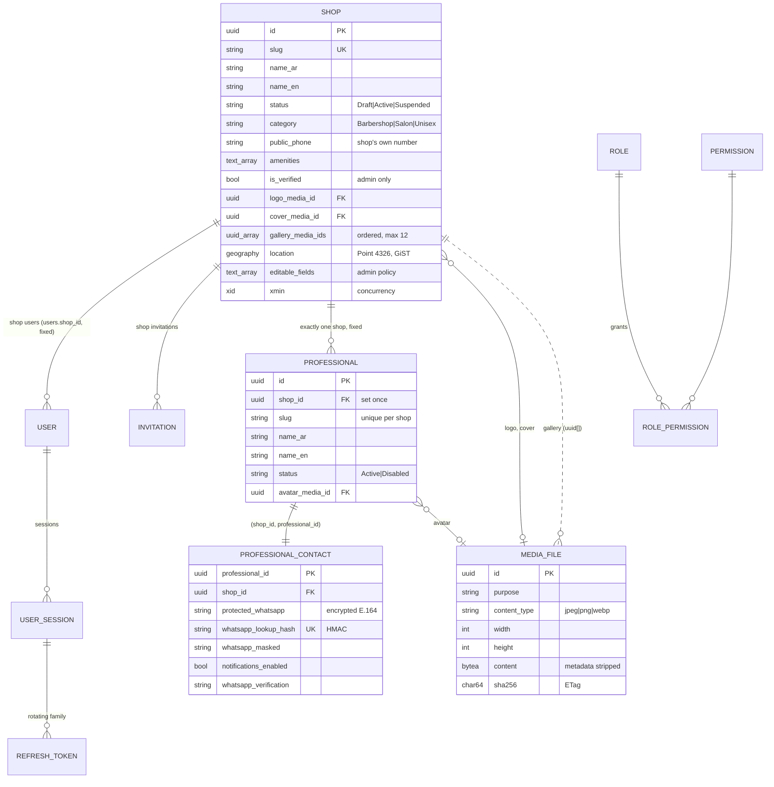

# TRIMME — Domain model

The model as built so far (Phases 04–06), with the invariants each part enforces. Later phases extend this file:
services and packages (07), subscriptions and settings (08), schedules (09), bookings (10), reviews, notifications and
QR (11–16). The spec's target model is in spec §8. Decisions are referenced as D-xxx (`docs/implementation/DECISIONS.md`).

One PostgreSQL database with one schema per module. Identifiers are UUIDv7 wrapped in typed ids. Instants are UTC
`timestamptz`, and optimistic concurrency uses PostgreSQL `xmin`.

## Shops (`shops`) — the tenant root

**Shop** (D-059, D-061, D-065) is the tenant of every shop-owned row.
- **Lifecycle.** Created by an admin as Draft, then Active; an admin can Suspend it and activate it again. A suspended shop's users have no tenant, so its data is unreachable at once and nothing is deleted.
- **Profile.** Localized name and description, category, the shop's own public phone (E.164), amenities, logo, cover and a gallery of up to 12 images.
  - `IsVerified` is admin-only.
  - `EditableFields` is the admin policy that opens profile areas to the shop. The server rejects a changed locked field with 403.
- **Location.** An owned value stored on the shop row: `geography(Point,4326)` (X = longitude, Y = latitude, 6 decimal places), address line, district, city, formatted address, source (Manual, Geocoded, Device), and confirmed at/by. There is a GiST index for nearby search (Phase 11).
- **Visibility.** The shops table is a public directory, but a shop user reads only their own shop row. Public pages publish active shops only (D-066).

## Professionals (`professionals`)

**Professional** (D-011, D-067) is a barber or stylist, created by a platform admin in exactly one shop.
- `ShopId` is set by the factory and never changes. No update contract carries it, EF refuses to modify it (it is part of the `(shop_id, id)` key), and the tenant rules reject any `ShopId` change.
- Its slug is unique within the shop. Status is Active or Disabled; disabled professionals leave public pages and are not offered for new bookings (Phase 10).

**ProfessionalContact** holds the WhatsApp number.
- The number is stored only encrypted (Data Protection purpose `trimme.professional-whatsapp`), with an HMAC lookup hash that is unique platform-wide (one person, one professional) and a mask for lists (`+966 5•• ••• •67`).
- Notifications can be on only while a number is set; `CanReceiveNotifications` means both are true.
- Changing the number resets the verification state.
- Only admins with `RevealWhatsApp` read the full number (with a reason, audited), plus the notification worker in Phase 15. Shops and customers never receive it.

## Media (`media`, building blocks)

**StoredMedia** (D-064) is an image kept in PostgreSQL.
- Only JPEG, PNG or WebP, recognised from its bytes. Size limits apply, and EXIF/GPS, XMP, IPTC and PNG text are removed.
- It has no shop id: its only owner is the aggregate that references it, and uploads create the image and the reference together. Images never change in place (new upload, new id).

## Identity (`identity`)

Users of three types — Customer, ShopUser, PlatformAdmin (D-050) — sit on one table.
- **Customers** are passwordless. Their mobile is encrypted, with a lookup hash.
- **Staff** use email and password.
- **Shop users** carry `shop_id`, which is set once (`ITenantMember`).
- **Roles and permissions.** Roles map to data-driven permissions (`role_permissions`). The permission catalogue is code, synchronised by `migrate`.
- **Supporting records:** sessions with rotating refresh-token families (D-052), OTP challenges (D-054) and invitations (D-055).

## Administration (`administration`)

**AuditEntry** (D-063) is append-only.
- It records the actor, action, entity, shop, a PII-free summary, the reason and the correlation id.
- It is written in the same unit of work as the change.
- Phase 06 actions:
  - `shop.profile_updated`, `shop.location_set`, `shop.editable_policy_set`, `shop.image_changed`;
  - `professional.created`, `.updated`, `.enabled`, `.disabled`, `.avatar_changed`;
  - `professional.whatsapp_changed`, `.whatsapp_revealed`.
