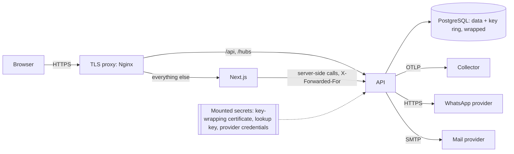

# Security

Threat model, production security configuration, key rotation and the Phase 17 scan results. The controls themselves are described where they live: `docs/architecture.md` §2 (security baseline, sessions, tenancy), `docs/permissions-matrix.md`, `docs/observability.md` (logging and redaction) and the decisions cited below.

## 1. Assets and actors

| Asset | Why it matters |
|---|---|
| Customer mobile numbers and names | Personal data; the number must never reach a shop (non-negotiable 2) |
| Professionals' WhatsApp numbers | Personal data managed by admins (D-067) |
| Sessions and staff credentials | Account takeover, including platform admins |
| Each shop's data (bookings, services, prices, schedules) | Tenant isolation (non-negotiable 1) |
| Booking integrity | Double booking and price tampering |
| Subscription plans and prices | SuperAdmin only (non-negotiable 6) |
| Secrets: Data Protection key ring, lookup HMAC key, WhatsApp, SMTP, key-wrapping certificate | Each one unlocks one of the above |

| Actor | Can reach |
|---|---|
| Anonymous visitor or bot | Public pages and APIs, sign-in, OTP, QR scans |
| Customer | Their own profile, bookings, reviews and favorites |
| Shop owner or staff | Their own shop only, by session claim |
| Platform admin (including an insider) | Permission-gated admin APIs; every action audited |
| Someone holding a database copy or backup | Every table, but not the mounted secrets |
| A compromised dependency or third-party script | Whatever runs in the browser or the API |

Trust boundaries: the browser and the proxy; the proxy and the two applications; the API and the database; the API and each provider. Secrets cross none of them except as mounted files or environment variables.

## 2. Threats and controls

| Threat | Control | Evidence |
|---|---|---|
| OTP guessing or flooding | 6 digits, 3 attempts per code, 5 codes per number per hour, 30 s cooldown; `otp` limit per IP; enumeration-safe answers (D-054) | `OtpSignInTests`; `RateLimitPolicyTests` |
| Staff credential stuffing | Lockout after 5 failures for 15 minutes; dummy hash for unknown emails; `auth` limit (D-055) | `StaffAuthTests`; `RateLimitPolicyTests` |
| Session theft or replay | HttpOnly, Secure, SameSite cookies; 15-minute access; rotating refresh with reuse detection; revoke-all; the session re-checked on every request (D-052) | `SessionTests` |
| Cross-site request forgery | Double-submit token on every unsafe request, anonymous ones included (D-053) | `CsrfTests` |
| Cross-site scripting | React escaping; JSON-LD escaped; a per-request nonce CSP with `strict-dynamic`; no inline script without the nonce (D-117) | `csp.test.ts`; every E2E test fails on a CSP violation |
| Credentials in URLs before hydration | Every JavaScript-handled form posts; only filters use GET (ZAP finding) | `forms.test.ts` |
| Clickjacking | `frame-ancestors 'none'` and `X-Frame-Options: DENY` on the web and the API | ZAP baseline |
| Cross-shop reads or writes (IDOR) | Shop from claims only; query filters; stamping; composite foreign keys; `IgnoreQueryFilters` banned (D-059 to D-062) | `CrossShop_*`; architecture tests; E2 |
| Customer number reaching a shop | Shop DTOs carry no contact data; contract tests over every shop endpoint | DTO contract tests; R-NEG tests; the Phase 17 leak sweep (§5) |
| Personal data in logs, traces, jobs or the outbox | Templates without personal data; redaction enricher; query values redacted in spans; job arguments and payloads are identifiers (D-118) | `ObservabilityTests`; the leak sweep (§5) |
| Theft of a database copy | Numbers encrypted with Data Protection; the key ring wrapped with a certificate that is never stored in the database (D-120); lookups by keyed HMAC | `KeyEncryptionTests` |
| Malicious uploads (polyglots, metadata, decoder exploits, bombs) | Type from magic bytes; header pixel cap before decoding; re-encoding from pixels; 5 MB limit (D-119) | `ImageReencoderTests`; `Images_AreStoredInTheDatabase_…`; the compose upload check |
| Double booking or price tampering | Server-side availability; transactional recheck; exclusion constraint; idempotency; prices from the server, snapshotted (D-086 to D-089) | Concurrency suite; E6 |
| Privilege escalation | Default-deny endpoint matrix; permission policies; SuperAdmin-only pricing; invitation escalation guard (D-106); no transfer route | `AuthorizationMatrixTests`; no-transfer gate |
| Forged WhatsApp status callbacks | HMAC signature over the body (D-110) | Webhook tests |
| Abuse of expensive endpoints (DoS) | A named rate limit on each abusable endpoint (spec §18); 1 MB body limit; capped page sizes; output cache for public reads (D-093) | `RateLimitPolicies_AreAttachedToExactlyTheReviewedEndpoints`; `RateLimitPolicyTests` |
| Leaking internals in errors | Problem details with stable codes; no stack traces; minimal health payloads | `HttpConventionTests` |
| Vulnerable dependencies | `pnpm audit` and `dotnet list package --vulnerable` clean; Newtonsoft pinned (Phase 15) | §5 |
| Secrets in the repository | gitleaks on the directory and the full history | §5 |

## 3. Production configuration (required)

Outside Development and Testing, the API refuses to start without the first three settings, or with `Identity__Otp__Sender=DevInbox`.

| Setting | Purpose |
|---|---|
| `PersonalData__LookupKey` | Base64, at least 32 bytes: the HMAC key for number lookups |
| `DataProtection__CertificatePath`, `DataProtection__CertificatePassword` | The PKCS#12 file that wraps the key ring (D-120), mounted as a secret |
| `Email__Smtp__*` | Staff invitations and password resets (D-056) |
| `Identity__Otp__Sender=WhatsApp` | Sign-in codes through the WhatsApp authentication template (D-054, D-111). Without it, code requests answer 503 |
| WhatsApp provider settings | `docs/whatsapp-integration.md` |
| `Cors__AllowedOrigins__0` | The public origin, exactly |
| `ReverseProxy__KnownProxies__N` / `ReverseProxy__KnownNetworks__N` | The proxy's address and the web containers' network (below) |
| `TRIMME_SITE_URL` (web) | The public `https://` origin. It also turns on HSTS and `upgrade-insecure-requests` |
| `NEXT_PUBLIC_MAP_TILE_URL` (web build, compose `TRIMME_MAP_TILE_URL`) | The production tile host (D-007), for example `https://tiles.example.org/{z}/{x}/{y}.png`. Its origin is added to the CSP automatically |
| `Geocoding__Provider=Nominatim`, `Geocoding__Nominatim__BaseUrl`, `Geocoding__Nominatim__UserAgent` | The production geocoder: a self-hosted or OSM-based Nominatim-compatible host (D-007, D-068). Without them, address search uses the built-in development gazetteer |
| `TRIMME_ENABLE_DEV_ROUTES` (web) | Unset or `false` |
| `OTEL_EXPORTER_OTLP_ENDPOINT` (optional) | Telemetry export (D-118) |

### Client addresses behind the proxy

The rate limits, the QR visitor hash and the server-rendered calls all depend on the real client address (D-094, D-114). The repository has no Nginx file (D-116), so a deployment must meet these requirements:

1. The proxy **overwrites** the header with the client's address: `proxy_set_header X-Forwarded-For $remote_addr;`. Appending (`$proxy_add_x_forwarded_for`) would let clients choose their own address. It also sets `X-Forwarded-Proto $scheme`.
2. `/api/` and `/hubs/` go to the API, with WebSocket upgrade headers for `/hubs/`. Everything else goes to the web app.
3. The API trusts forwarded headers only from the proxy (`ReverseProxy__KnownProxies__0`) and from the web containers' network (`ReverseProxy__KnownNetworks__0`, CIDR). The web app forwards the visitor's address on its server-side calls.
4. `/health/*` is not exposed publicly. Only `/api` and `/hubs` reach the API.
5. TLS terminates at the proxy, which may also send HSTS.
6. Requests up to 6 MB are allowed (`client_max_body_size 6m`): image uploads are 5 MB plus multipart framing. The API answers a larger body with 413 itself (D-069).

Without step 3, every visitor counts as one client: the `auth` and `otp` limits would lock out everyone at once.

## 4. Keys and rotation

| Secret | Rotation | Effect and procedure |
|---|---|---|
| Data Protection keys | Automatic: a new key every 90 days (the framework default) | Old keys are kept, so older ciphertext, sessions and reset links stay valid until they expire. Nothing to do |
| Key-wrapping certificate | Yearly, or at once if exposed | 1. Mount the new PFX and set it as `DataProtection__CertificatePath`/`Password`. 2. Move the old one to `DataProtection__PreviousCertificates__0__Path`/`Password`. 3. Restart every API instance. 4. After 90 days, once every key wrapped with the old certificate has expired, remove it. Before step 4, a host without the old certificate cannot read data protected by those keys (`KeyEncryptionTests`) |
| Lookup HMAC key (`PersonalData__LookupKey`) | Only if exposed | Every lookup hash (sign-in by number, uniqueness) depends on it. **No re-keying tool exists**: rotation needs a maintenance job that decrypts each number and recomputes its hash with the new key, run while sign-in is closed. Until then, keep it as long-lived as the database |
| WhatsApp access token, webhook secret | As the provider requires, or if exposed | Rotate at the provider, update the environment, restart. Status callbacks signed with the old secret are rejected after the switch |
| SMTP and OTLP credentials | As the provider requires | Update the environment and restart |
| Staff passwords | On suspicion | An admin resets the password; a reset signs out every session (D-055) |
| All sessions of a user | On suspicion | Customers: "sign out other devices" on the security page. Staff: `POST /api/v1/auth/sessions/revoke-all`, or a password reset, which ends every session |

A database backup holds the wrapped key ring and the ciphertext, never the certificate or the lookup key. Store those separately from backups.

## 5. Phase 17 scans

Exact results are in `docs/implementation/phases/phase-17-hardening.md` (Completion evidence).

| Check | Scope |
|---|---|
| `pnpm audit` | Web and E2E workspace. One ignored advisory, in root `package.json` `pnpm.auditConfig.ignoreCves`: CVE-2026-93687 (GHSA-vfj7-8cjw-p6xm, `braces` ≤ 3.0.3, a stack-exhaustion DoS on deeply nested patterns), published 2026-09-18 with no patched release. It is only reached through `eslint-config-next` → `fast-glob` → `micromatch`, a lint-time dev path that runs on our own source patterns and never ships in the app. Remove the ignore once a fixed `braces` (or a `micromatch`/`fast-glob` without it) is released. `source-map-js` is pinned to ≥ 1.2.2 by a pnpm override (GHSA-68fv-2mgg-jv7q, an event-loop DoS fixed in 1.2.2; it reaches us through `postcss` and Tailwind at build time); drop the override once `next` and Tailwind depend on 1.2.2 or later |
| `dotnet list package --vulnerable --include-transitive` | Every project |
| gitleaks (`dir` and `git`) | The working tree and the full history |
| OWASP ZAP baseline (`zap-baseline.py`, spider 3 min) | The compose web app at `/ar`, through the same-origin `/api` |
| Phone-leak sweep | API and web container logs, exported spans, Hangfire job arguments and states, outbox payloads; shop pages in the route audit |

### ZAP findings and their handling

| Finding | Handling |
|---|---|
| A form submitted without JavaScript sent the email and password in the URL | **Fixed.** Every JavaScript-handled form posts (`forms.test.ts`) |
| No CSP on files and on 404 responses for missing files | **Fixed.** Paths with an extension get a fixed policy without script |
| COOP and CORP missing | **Fixed.** Both `same-origin` on every web response (the API, reached through the same origin, keeps `same-site`) |
| Absence of anti-CSRF tokens (second run, once forms post) | Expected: a native post to a page does nothing. The real submit is the JavaScript call, which carries `X-CSRF-Token` (D-053) |
| `style-src 'unsafe-inline'` | Accepted (D-117): React `style` attributes, Radix and MapLibre. Scripts stay nonce-only |
| COEP missing | Accepted: `require-corp` would block the map's cross-origin tiles |
| `NEXT_LOCALE` cookie without HttpOnly | Accepted: a locale preference, not a secret |
| "Big redirect", missing content type on redirects, non-storable content, modern web app, user-controllable attribute (`sort`, `category` echoed into escaped attributes) | Informational. React escapes attribute values |

Findings that exist only because the scanned stack runs in Development (no HSTS, plain HTTP, the API reference and dev routes enabled) are not listed. Production turns each of them off (§3).

## 6. Residual risks

- **No second factor for staff and admins.** Passwords, lockout and invitations only. TOTP for platform admins is the first addition to make.
- **Rate limits are per API instance** (in memory). With N instances an attacker gets N times the budget; a shared store is needed before scaling out.
- **The public OpenStreetMap tile and geocoder services** are for development only (D-007); production must point at its own host.
- **Public HTML cannot be cached** by a shared cache, because every page carries a nonce (D-117). Public API reads and static files are cached instead (D-121).
- **Changing the lookup key** has no tool (§4).
- **The screen-reader pass** (NVDA) is a manual check for the operator (`docs/accessibility.md`).
